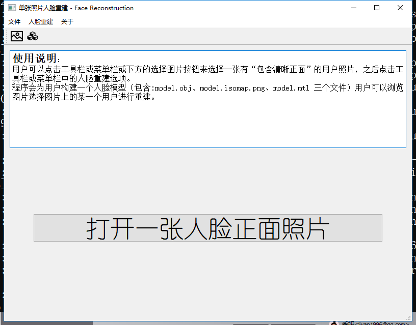
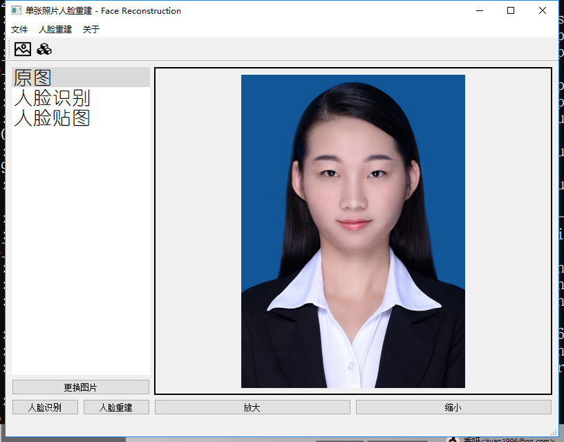
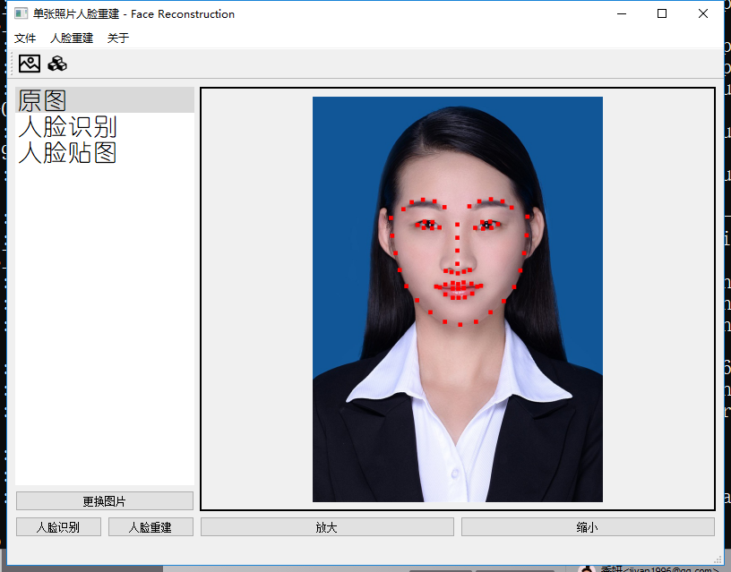
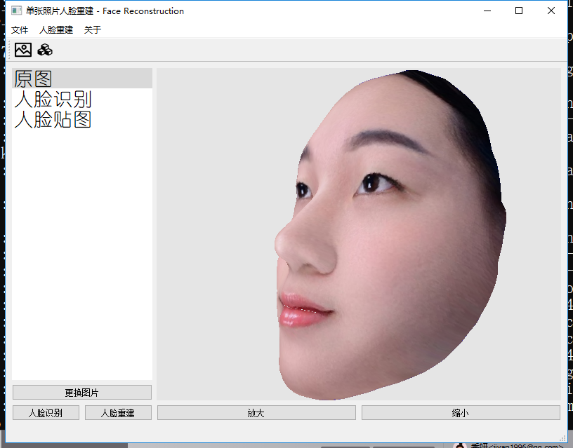

# Readme
This project use the Surrey Face Model to contribute a face reconstruction application. If you want to understand the algorithm of this application, you could read this paper first. [PDF](http://www.patrikhuber.ch/files/3DMM_Framework_VISAPP_2016.pdf)

I just rewrite some code using Qt5, maybe at least Qt 5.5, the default qt version of ubuntu 16.04.

# Show
This project contains two main part: **GUI and Console**. They are sub project of `FaceReconstruction.pro`.

## Console
The console project is subproject `console/console.pro`. It can be run in the system without a monitor, on Windows or linux.

Usage is shown as blow:
```
ubuntu：~$ cfaceRec --help
Usage: ./cfaceRec [options]
Face Reconstruction

Options:
  -h, --help                   Displays this help.
  -v, --version                Displays version information.
  -i, --image-path <filepath>  The image path to do face reconstruction! <path>
                               e.g. E:/test.jpg
  -s, --save-path <directory>  The directory to save the obj model <driectory>
                               e.g. E:/test/
```

## GUI
The GUI application is write in subproject at `start/start.pro`, It must comple with monitor, or may not success.






# How to build
This project needs some useful 3rdpart.
```
opencv 2.4.11
assimp 3
boost 1.5
dlib 17.17
```

And you may set the path of them in thost `*.pro` file, it is not easy for newbee.

```
unix {
    INCLUDEPATH += $$PWD \  # 自身
                   $$PWD/../start \                                   # subproject start
                   $$PWD/../libs \
                   $$PWD/../libs/dlib-18.17 \                          # dlib
                   $$PWD/../libs/eigen-eigen-b9cd8366d4e8 \            # eigen
                   /usr/include \                                      # boost assimp
                   /usr/local/include                                  # opencv

    LIBS += \
            -L /home/chaoqun/dlib-18.17/build -ldlib \                      # dlib
            -L/usr/lib/x86_64-linux-gnu -lboost_system -lboost_filesystem \                         # boost
            -L/usr/local/lib -lopencv_calib3d -lopencv_contrib -lopencv_core \
                -lopencv_features2d -lopencv_flann -lopencv_gpu \
                -lopencv_highgui -lopencv_imgproc -lopencv_legacy \
                -lopencv_ml -lopencv_objdetect \
                -lopencv_ocl -lopencv_photo -lopencv_stitching -lopencv_superres \
                -lopencv_video -lopencv_videostab \                                                 # opencv
            -L/usr/lib/x86_64-linux-gnu -lassimp                                                    # assimp
}
```

# Reference
 - A Multiresolution 3D Morphable Face Model and Fitting Framework, P. Huber, G. Hu, R. Tena, P. Mortazavian, W. Koppen, W. Christmas, M. Rätsch, J. Kittler, International Conference on Computer Vision Theory and Applications (VISAPP) 2016, Rome, Italy [PDF](http://www.patrikhuber.ch/files/3DMM_Framework_VISAPP_2016.pdf).
- Project [eos](https://github.com/patrikhuber/eos)
- Project [FaceReconstruction](https://github.com/KeeganRen/FaceReconstructio)
